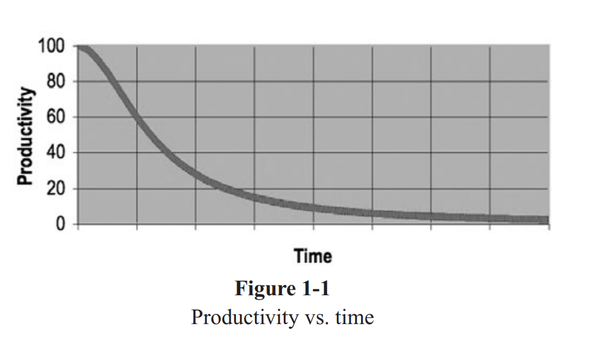
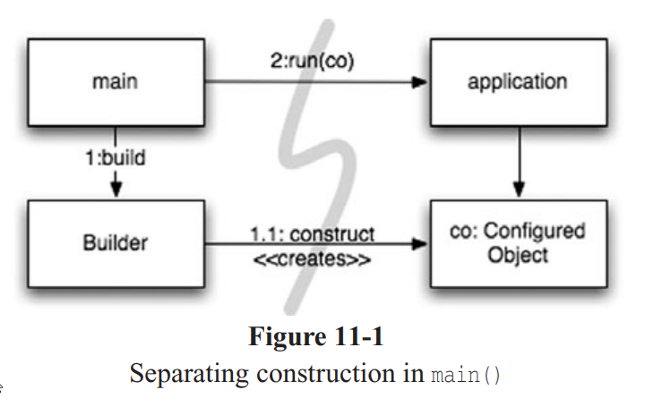
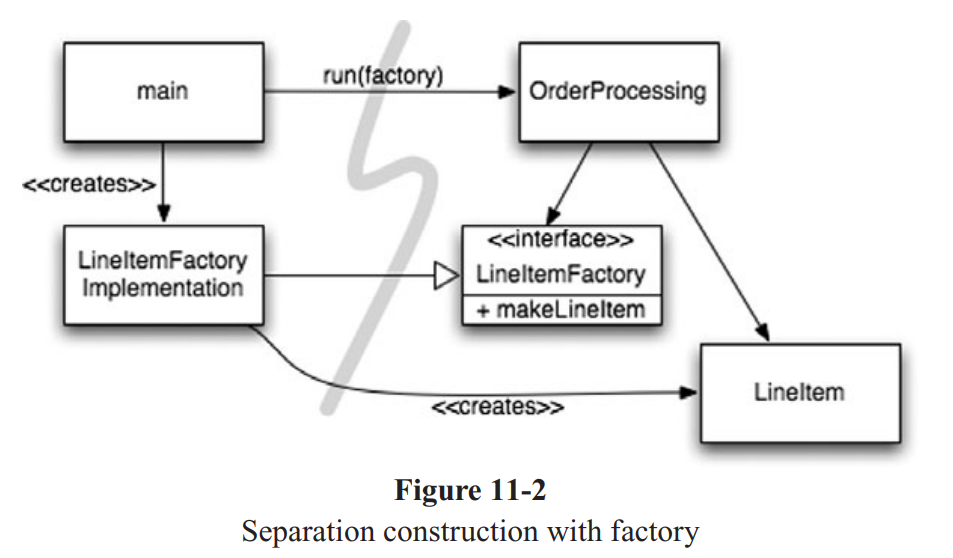

# Chapter 1 : Clean Code


why should we learn to code? shitty idea in my opinion, ai models are doing a better job. most of the code is generated rather than written.

we have specifications, and ai models can generate code based on those. but this idea is wrong.

specifying requirements in such detail that a machine can execute them is programming, such a specification is code.

even humans can't understand vague feelings of other humans. how could computers do such a thing?

so there will always be code, there cannot be a computer that understands our vague needs and specifications.

### **code** is the language in which we ultimately express the requirements.

**code** will never be eliminated.

messy code makes the productivity of the code to asymptotically approach zero. after productivity decreases in order to increase it, management decides to recruit new members. **but that new member does not know the difference between a change that matches the design, or a change that tangles the design.**



eventually, bad code, leads to another team redesigning the current working but no so efficiently system, and this is not cost-friendly and this battle of to two teams competing to build a system can last forever.

### good code rots into bad code, rather quickly.


### Programming Conundrum

prorgammers face a conundrum of basic values, they all know bad code, slows them down. yet, still under the pressure of deadlines they feel the need of making a mess.

it's no good to write clean code without knowing what clean code is.

### What is `Clean Code` like?

a good metaphor is that, a building with broken windows looks like nobody cares about it. so other people stop caring. they allow more windows to become broken. eventually they actively break them. they despoil the facade with graffiti and allow garbage to colect. one broken window starts the process toward decay.

paying attention to details in programming is `error handling`, `memory leaks`, `race condition`.

clean code does one thing well.

clean code is `focused`. each function each class each module exposes a single-minded attitude that remains entirely undistracted and unpolluted, by surrounding details.

clean code is straightforward lines of control.

##### here the book rambles about different perspectives of programming languages creators on clean code, i couldn't be arsed to read it, soooo :))))

### Who are we? `@authors`

@authors remembers us that we are authors, what do authors have? `readers`. so next time writing a line of code remember that you are an author, writing for readers who will judge your effort.

`why bother?` old editors like Emacs used to keep track of every keystroke. you could play it back. most of this time went to scrolling and navigating to other modules.

### ratio of time spent reading to time spent writing is 10:1

even if writing clean code makes writing harder, it eases the reading part. so fucking write clean code.

### The Boy Scout Rule

#### Leave the campground cleaner than you fonud it.

if we all checked-in our code a little cleaner than when we checked it out the code simply could not rot. the cleanup doesnt have to be something big. change a variable name for the better, break up one function that's a little too large, eliminate one small bit of duplication, clean up one composite if statement.

the final shithousery of this chapter is the fact that it tells you, books on art don't promise to make you an artist. all they can do is give you some of the tools, techniques and thought processes that other artists have used.

### In this book, we learn the thought process of good programmersand the tricks, techniques, and tools that they use.

# Chapter 2 : Meaningful Names

it is easy to say that names should reveal intent. what we want to impress upon you is that we are `serious` about this.

take time with your names and change them when you find better ones. everyone who reads your code will be happier if you do so(even you).

the name of a variable, function or class should answer all the big questions.

it should tell you:
- **why it exists.**
- **what it does.**
- **how it is used.**

if a name needs a comment, it does not reveal its intent.

```c++
int d; // elapsed time in days
```

this variable does not evoke any sense of elapsed time, nor days.

### we should choose a name that specifies what is being measured and the unit of that measurement.

```c++
int elapsedTimeInDays;
int daysSinceCreation;
int daysSinceModification;
int fileAgeInDays;
```

choosing names that reveal intent, makes understanding and changing code much easier.

### Example of a simple yet hard to understand code.
```cpp
public List<int[]> getThem() {
    List<int[]> list1 = new ArrayList<int[]>();
    for (int[] x : theList)
        if (x[0] == 4)
            list1.add(x);
    return list1;
}
```

### Previous example but with good variable name choices.

```cpp
public List<int[]> getFlaggedCells() {
    List<int[]> flaggedCells = new ArrayList<int[]>();
    for (int[] cell : gameBoard)
        if (cell[STATUS_VALUE] == FLAGGED)
            flaggedCells.add(cell);
    return flaggedCells;
}
```

the simplicity of the code has not been changed but the code became more `explicit`.

even more, we can create a class for cells instead of using an array of `int's` and that could include an intention revealing function (call it `isFlagged`) to hide the magic numbers.

```cpp
public List<Cell> getFlaggedCells() {
    List<Cell> flaggedCells = new ArrayList<Cell>();
    for (Cell cell : gameBoard)
        if (cell.isFlagged())
            flaggedCells.add(cell);
    return flaggedCells;
}
```

### Avoid Disinformation

programmers must avoid leaving false clues that obscure the meaning of code.

variables like `hp`, `aix` and `sco` are not good because they are variants of Unix platforms or variants.

**do not refer to a grouping of accounts as an `accountList` unless it's actually a `List`.**

if it's not a list refer to it as `accountGroup` or `bunchOfAccounts` or just `Accounts`.

**Beware of using names which vary in small ways.**

### why should we make names, `obviously` different.

```cpp
getActiveAccount ();
getActiveAccounts();
getActiveAccountInfo();
```

**how is a programmer able to acknowledge which function to call?**

**in the absence of specific conventions** the variable `moneyAmount` is indistinguishable from `money`, `customerInfo` from `customer`.

### Use Pronounceable names

make names pronounceable so that your code could be quote on quote `spoken`.

why does it matter? **programming is a social activity.**

### Use Searchable names

single letter variables cannot be searched.

single letter variables can `ONLY` be used as local variables inside short methods.

### the length of a name should correspond to the size of its scope.

### Avoid encoding

if a variable or constant might be seen or used in multiple places in a body of code, it is imperative to give it a `search-friendly name`.

### Do not add member prefixes

```cpp
    m_dsc = name; // this is a member function.
```

### Avoid naming interfaces and implementations old fashioned

```java
// Interface
public interface ShapeFactory {
    Circle createCircle();
    Rectangle createRectangle();
}

// Concrete implementation
public class ShapeFactoryImpl implements ShapeFactory {
    @Override
    public Circle createCircle() { ... }

    @Override
    public Rectangle createRectangle() { ... }
}
```

### Avoid mental mapping

readers should not mentally translate your names into other names they already know.

this problem arises from a choice to use neither problem domain terms nor solution domain terms.

traditionally we use i,j,k for loop counters if its scope is very small. if they don't conflict with anything, this kinda naming is a good choice.


### Class names

class and object names should have noun or noun phrase names like `Customer`, `WikiPage`, `Acconut` and `AddressParser`.

a class name should `not` be a `verb`.

### Method names

method names should be `verbs`.

accessors, mutators and predicates should be named for their value and prefixed with `get`, `set` and `is`.

when constructor are overloaded use static factory methods with names that describe the argument like `Complex.FromRealNumber(23.0);`.

### Don't be cute white guy.

your sense of humor is trash, don't try to act funny.

### Pick one word per concept.

don't try to have `fetch`, `retrieve` and `get` as equivalent methods for different classes.

### Don't pun.

do not use the same word for two concepts.

if you have multiple classes and they all have an `add` method, as long as the parameter lists and return values of the various `add` methods are semantically equivalent, all is well.

### Use solution domain names

your audience are mainly programmers so using cs terms, algorithms or pattern names is an okay thing. like a `JobQueue`.

### Use problem domain names

when there is no programmer for what you do, use names from problem domain. at least the programmer could ask a domain expert what it means.

### Add meaningful context

if you see `state` would you know its for an `Address`?
no, so instead of `state` use `addrState`.


### Final Rambles.

hardest thing about choosing good names is that it reuires good descriptive skills and a shared cultural background.

# Chapter 3 : Functions

first rule, they should be `small`.

### Blocks and Intending

blocks within `if`, `else`, `while` and so on should be 1 line long, that line should probably be a function call.

the indent level of a function should not be greater than 1 or 2.
functions should do one thing. they should do it well. they should do it only.

if the function contains steps at many different levels of abstraction, it is not doing one thing.

another way to know that a function is doing more than `one` thing, is if you can extract another function from it with a name that is not merely a restatement of its implementation.

### Sections within functions

if a function contains, declaration, initialization and sieve, or something of this fabric, it is doing more than one thing.

### One level of abstraction per function

we need to make sure that the statements within our function are all at the same level of abstraction.

an example : `getHtml();` high level, `PathParser.render(pagePath)` intermediate level, `.append('\n')` is a low level of abstraction.

once `details` are mixed with essential concepts, more and more details tend to appear within the function.

### The stepdown rule

we want the code to read like a top-down narrative.

we want every function to be followed by those at the next level of abstraction so that we can read the program, descending one level of abstraction at a time as we read down the list of functions.

it is hard to write functions that stay at a single level of abstraction.

### Switch statement

we cannot avoid `switch` statements, but we can make sure that each `switch` statement is buried in a low-level class and is never repeated.

### Use descriptive names

you know you are working with clean code when each routine turns out to be pretty much what you expected.

the smaller and more focused a function is, the easier it is to choose a descriptive name.

a long descriptive name is better than a long descriptive comment.

### Function arguments

the ideal number of arguments for a function is `zero`. then `one`, closely `two`.

you should avoid using `three` argument functions.

we do not expect the information going `out` of a function through `argument`, but by `result`.

`Flag arguments` are terrible.

two arguments for a function like `Point` is perfectly reasonable, because pay attention `these two arguments are ordered components of a single value`.

how the hell do we transform two argument functions into one argument function?

if lets say our function accepts an argument like `outputStream`, this argument could be passed to the function, via making that function a method of a class and that `outputStream` is a member of this class.

### Argument objects

when a function seems to need more than two or three arguments, it is likely that some of those arguments need to be wrapped into a class of their own.

```cpp
Circle makeCircle(double x, double y, double radius);
Circle makeCircle(Point center, double radius);
```

`x` and `y` are a part of a concept that deserves a name of its own.

### Argument list

if some of arguments are treated identically, they are equivalent to a single argument of type `List`.

### Verbs and keywords

for monad(1 argument) functions -> verb/noun pair. `WriteField(name);`

using good names for functions, removes the fact that we have to remember the order of the arguments.

### Have no side effect

your function promised to do one thing, and it shouldn't hiddenly do other things.

if your function says `CheckPassword`, but it hiddenly also initializes the session by calling a function called `initSession`, someone who doesn't know this, and just read the function's name, now accidentaly initialized a session as well!!!

this creates temporal coupling -> calling `CheckPassword` is only safe to call when it is okay to initialize a session.

the name should be `CheckPasswordAndInitializeSession`.

### Output arguments

`appendFooter(s)` s is an output argument rather than input argument.

is s the footer? is something added to s?

this makes to `double-check` meaning that you have to at least the functions signature.

nowadays, the purpose of object oriented keyword `this` is actually an output argument.
so do this.

`report.appendFooter()`.

### Command query seperation

a function either should do something, or answer something, not both.

`set('username','unclebob')`.

the author used the verb set to be a verb, but in the context of the `if` statement it feels like an adjective.

if the `username` was previously set to `unclebob` and not set the `username` attribute to `unclebob` and if that worked then ... .

the function could be named `setAndCheckIfExists`, this still doesnt help the readablity of the `if` statement. the real solution is to seperate `command` from `query`.

### Exceptions over error codes

when you return the error code, you make caller forced to deal with the error immediately.

### Extract try/catch blocks

try/catch blocks mix error processing with normal processing.

it is better to extract the bodies of the `try` and `catch` blocks out into functions of their own.

```cpp
 public void delete(Page page) {
 try {
 deletePageAndAllReferences(page);
 }
 catch (Exception e) {
 logError(e);
 }
 }
```

this function is all about `error processing`.

the function `deletePageAndAllReferences` is all about deleting a page.error handling can be ignored. this provides a nice seperation that makes the code easier to understand and modify.

### Error handling is one thing

functions should do one thing, error handling is one thing. fucking remember.

### Don't repeat yourself

duplication may be the root of all evil in a software.

### Structured programming

the man himself, greatest of all time, the reason i failed algorithms, mother of all routing problems, dijkstra the great, had a rule for structured programming. every function, every block within a function, should have one entry and one exit. following these rules means that there should only be one `return` statement in a function, no `break` or `continue` statement in a loop, and never, ever, ever, everrrrrrr, the trashy `goto` statement nobody likes.(boooooooooooo)

this rule is actually for big functions, chunky ones. but if your functions are small, the occasional multiple `return`, `break`, or `continue` does not harm a fly.

### How to write these functions?

like writting an essay, you write your functions at first, then write some unittest.then you start massaging(pause) the code, refining it, changing names, splitting functions and so on, while keeping the tests passed.

at the end you have functions with clean code rules.

### Final rambles of this chapter

every system built is from a domain-specific language designed by the programmers to describe that system.

functions are the verb of that language, classes are the nouns.

### the art of programming is actually the art of designing a language.

systems are stories to be told rather than programs to be written.

# Chapter 4 : Comments

nothing can be quite so helpful as a well-placed comment.

if our programming was expressive enough we would not need comments.

the proper use of comments is to compensate for our failure to express ourself in code.

`failure` is a keyword.
comments are always `failures`.

whenever you need to write a comment, se whether there isn't some way to express yourself in code.

### Comments do not make up for bad code

### Explain yourself in code

## Good comments

keep in mind that the only good comment is the one you found a way not to write.

### Legal comments

coding standards sometimes forces us to write comments.

like legal comments, @author, @copyright, etc.

### Informative comments

it is sometimes useful to provide basic information.
like a comment that explains the return value of an abstract method.

```cpp
// Returns an instance of the Responder being tested.
protected abstract Responder responderInstance();
```

this comment could be made redundant by renaming the function to `responderBeingTested`.

### Explanation of intent

sometimes a comment provides the intent behind a decision.

like 
```cpp
// this is our best effort to handle this.
```

### Clarification

sometimes it is better to make an argument or return value readable by comments(like when it is from standard libraries.)

### Warning of consequences

sometimes it is useful to warn other programmers about consequences.

### Todo comments

leave them to notify needed updates to that section.

### Amplification

a comment may be used to amplify the importance of something that may otherwise seem inconsequential.

## Bad Comments

most comments are bad.

### Mumbling comments

if you want to write a comment, take the time to write the best comment.

any comment that forces you to `look in another module` for the meaning of that comment has failed to communicate.

### Redundant comments

these comments are less informative than the code, do not justify the code, do not provide intent or rationale, and certainly are not easier to read than the code.

### Misleading comments

like when something happens `if` something else happens, but you write in the comment `when`, subtly different

### Mandated comment

silly to have every function javadoc, or every variable must have a comment.

### Journal comments

do not add a comment every time you change a module.

### Noise comments

```cpp
/**
 * Default constructor.
 */
protected AnnualDateRule() {
}
```

### Position markers

do not use the following, (sometimes makes sense.)

### Attributions and bylines

no need to add a comment just to say you wrote it.

### Commented out code

it is hard for others to decide whether to delete commented codes or not, so don't do it.

### Nonlocal Information

if you must write a comment, make sure it describes the code it appears near.
don't offer systemwide information in the context of a local comment.

### Too much information

don't put irrelevant descriptions.

### Inobvious connection

the connection between a comment and the code it describes should be obvious.

### Function header

for short functions that only do one thing, a well-chosen name is better than a comment header.

### Javadocs for nonpublic code


# Chapter 5 : Formatting

code formatting is super important.

average height of each file should be around 100 lines.

the name of the file should sufficiently tell us if we are in the correct part of the code or not.

### Use blank lines to seperate logics and parts.

### Related concepts should be vertically close together.

### Dependent functions, should be vertically close.

### In general, we want function call dependencies to point in the downward direction.

### No more than 120 characters per line.

# Chapter 6 : Objects and Data Structures

we do not want to expose the details of our data. rather we want to express our data in abstract terms.

worst option, add getters and setters left right and center.

### Difference between objects and data structures

objects hide their data behind abstractions and expose functions that operate on that data.

data strcuture expose their data and have no meaningful functions.

they are `virtual opposite`.

this is `procedural programming` (data + seperate logic).
```java
class Circle {
    public Point center;
    public double radius;
}

class Geometry {
    public static double area(Circle c) {
        return Math.PI * c.radius * c.radius;
    }
}
```
you can add a function called `perimeter`, easy.

this is `object oriented` (behaviour inside the object).

```java
interface Shape {
    double area();
}

class Circle implements Shape {
    private double radius;
    public double area() { return Math.PI * radius * radius; }
}
```
you can add a new shape `Triangle`.

```java
class Triangle implements Shape { ... }
```

### Complimentary of objects and data structures

procedural code (code using data structures) make it easy to add new `functions` without changing the `existing data structures`.

object oriented code on the other hand, makes it easier to add new `classes` without changing `existing functions`.

### The law of demeter

a module should not know about the innards of the `objects` it manipulates.
as we saw, objects hide their data and expose operations. this means that an object should not expose its internal structure through accessors because to do so is to expose rather than to hide its internal structure.

more precisely:

a method `f` of a class `C` should only call the methods of:
- `C`
- an object created by `f`
- an object passed as an argument to `f`
-an object held in an instance variable of `C`

in basic words we can say:
- Itself
- Its fields
- Its arguments
- Objects it creates

`talk to friends not strangers`.

### Train wrecks

this kinda code is called train wrecks because it looks like a bunch of coupled train cars.

### What is the difference between implementation and abstraction?

implementation : how the data is stored or calculated.

Example -> whether `Point` uses x, y or r and theta.

abstraction : what can you do with the data.

Example -> `move point` or `get distance from`.

### Final rambles of this chapter

getters and setters make your private data public.

real encapsulation means hiding how things are done, not just putting a function around it.

# Chapter 7 : Error Handling

in short, things can go wrong, and when they do, the code we right has to know what to do.

### Use exceptions rather than return codes.

### try to write tests that force exceptions

### fun fact alert.

this fucking guy likes the word clutter.

here's the meaning -> cover or fill with untidy collection of things.

### Provide context with exceptions

each exception that you throw should provide enough context to determine the source and location of an error.

### Wrapping third-party api calls can be advantageous.

the process of following these rules, pushes error detection to the edges of your program.

you wrap your external APIs so that you can throw your own exceptions.

### Don't return null

### Don't pass null

# Chapter 8 : Boundaries

sometimes (quite often) we must integrate a foreign code with our own. we want to keep the boundaries of our software clean.

### Using third party

third-party packages want broad availablity but users want precise usage.
this tension can cause problems.

when we use a third-party package like `Map`, we don't want this api to run over our whole system because if we wanted to change this api to `BetterMap` we have to fully change our system. instead we wrap this api into our own version of it so we could have control over it. it might have a `delete` method which we would not wish to have, by wrapping the api into our own version we can define boundaries that our system has to have.

### Learning tests are better than free

if we write some tests to understand the gist of how this `third-party API` works, we learn api through it, and after some time we could check this tests to see if the api is still working how we wish it would work.

# Chaoter 9 : Unit Test

### Three laws of test driven development

- **first law** you may not write production code until you have written a failing unit test.
- **second law** you may not write more of a unit test than is sufficient to fail, and not compiling is failing.
- **third law** you may not write more production code than is sufficient to pass the currently failing test.

### What is a test suite?

a `collection` of test cases, that are grouped for test execution purposes.

### Moral of first pages

test code is just as important as production code.

### Unit test keeps our code flexible, maintainable, and reusable.

without test, every change is a possible bug.

### Three things to make clean tests. readability, readability and readability.

readability is more important in unit test than production test.

what makes it readable? same as other codes -> clarity, simplicity, and density of expression.

### Dual standards

there are things that you might never do in production environment that are perfectly fine in a test environment usually they involve issues of `Cpu` or `Memory` efficiency.
but they `never` involve issues of `cleanliness`.

### One assert per test

but this `given-when-then` convention creates an issue. `duplication.
we can use `template` method pattern by putting the `given/when` parts in the base class, and the `then` parts in different derivatives.

the best way to say this -> `the number of asserts in a test ought to be minimized`.

### Single concept per test

merging tests to getter is going to decrease our readability.

### First rule

- **Fast** tests should be fast, they should run quickly.they should be able to run `frequently`. if you don't run them frequently you won't be able to find bugs quickly.
- **Independent** tests should not depend on each other.one test should not set up the condition for another test. you should be able to run tests in any orders you want.
- **Repeatable** tests should be repeatable in any environment.they should be able to run in `production` environment, `QA` environment, etc.
- **Self-Validating** the test should have a `boolean output`.either they pass or fail.you should not read text files or logs to know that a test has failed or passed.
- **Timely** unit tests should be written `just before` the production code that makes them pass. if you write tests afterwards you might find the production code to be hard to test.


Invent testing APIs that act as domain-specific language that helps you write the tests.

# Notes until now

we have a function like : 

```python
async def get_task_by_title(title: str):
    async with async_session() as session:

        query = select(tasks_table).where(tasks_table.c.title ==title)
        result = await session.execute(query)
        task = result.fetchone()
        if task:
            return {'title' : task.title, 'deadline' : task.deadline.isoformat()}
        else:
            return None   
```

should we put `try/catch` block in this?

simple answer : `no`.

we should write `pure` functions that do what they do `business logic` and do `error handling` one level above.

we should not clutter this function with exception handling, the caller might want to react differently depending on context(API, test, etc).

### We handle exception when we call function not when we right them.


```python
@app.get('/title/{title}')
async def read_task_by_title(title: str):
    task = await db.get_task_by_title(title)
    if not task:
        return {'message': 'task not found'}
    return task

@app.get('/deadline/{deadline}')
async def read_task_by_deadline(deadline: str):
    tasks = await db.get_task_by_deadline(deadline)
    if not tasks:
        return {'message': 'tasks not found'}
    return tasks
```

the issue with this code is that we have repeating logic.

call database, validate output return it.

we can use helper functions that does this for us.

### this means that our logic for `not found` is scattered across our code, we need to centralize it.

### there are 2 more duplications in my code -> `async with async_session() as session` and `datetime.fromisoformat(deadline)`.

# Chapter 10 : Classes

classes should begin with a list of variables.

first static contsants, then private static variables then private instance variables.

there is seldom good reason to have a `public` variable.

public functions should follow the list of variables.

### Encapsulation

loosening encapsulation is always a last resort.

### Classes should be small

with functions we measured size by line, with classes, we measure size by `responsiblities`.

the name of the class should describe what responsibilities it fulfills.

naming is the first way of helping determine class size.

we should also be able to write a brief description of the class in 25 words, without using the words `if`, `and`, `or`, or `but`.

### The single responsibility Principle

the single responsibility principle (SPR) states that a class or module should have one, and only one `reason to change`. this principle gives us both a definition of responsiblity and a guidelines for class size.

this is an important quote -> a system with `many small classes` has no more moving parts than a system with a `few large classes`. there is just as much to learn in the system with a few large classes.

every sizeable system will contain a large amount of logic and complexity. the main goal in managing such complexity is to `organize` it so that a developer knows where to look to find things.

### Cohesion

classes should have a small number of instance variables.

in general the more variable a method manipulates the more cohesive that method is to its class. a class in which each variable is used by each method is `maximally cohesive`.

we would like the cohesion to be high. when a class is cohesive it means that the variables and methods hang together as a logical whole.

### Maintaining cohesion results in many small classes

to keep our classes cohesive enough we often end up with small classes.

### Organizing for change

for most systems change is continual.for now, lets work on this `sql` class.
lets say sql now supports `update`, we need to `open up` this class to make modifications.

the problem with opening a class is that it introduces risk. any modifications to the class have the potential of breaking other code in the class. it must be fully retested.
```cpp
public class Sql {
 public Sql(String table, Column[] columns)
 public String create()
 public String insert(Object[] fields)
 public String selectAll()
 public String findByKey(String keyColumn, String keyValue)
 public String select(Column column, String pattern)
 public String select(Criteria criteria)
 public String preparedInsert()
 private String columnList(Column[] columns)
 private String valuesList(Object[] fields, final Column[] columns)
 private String selectWithCriteria(String criteria)
 private String placeholderList(Column[] columns)
}
```

the `sql` class must change when we add a new type of statement. it also must change when we alter the details of a single statement type (if wee need to modify select functionality to support subselect). these two reasons to change mean that `sql` does not follow `single responsibility principle`.

other way to spot not following single responsibility is that `selectWithCriteria` only relates to `select`.

```cpp
abstract public class Sql {
 public Sql(String table, Column[] columns)
 abstract public String generate();
}
public class CreateSql extends Sql {
 public CreateSql(String table, Column[] columns)
 @Override public String generate()
}
public class SelectSql extends Sql {
 public SelectSql(String table, Column[] columns)
 @Override public String generate()
}
public class InsertSql extends Sql {
 public InsertSql(String table, Column[] columns, Object[] fields)
 @Override public String generate()
 private String valuesList(Object[] fields, final Column[] columns)
}
public class SelectWithCriteriaSql extends Sql {
 public SelectWithCriteriaSql(
 String table, Column[] columns, Criteria criteria)
 @Override public String generate()
}
public class SelectWithMatchSql extends Sql {
 public SelectWithMatchSql(
 String table, Column[] columns, Column column, String pattern)
 @Override public String generate()
}
public class FindByKeySql extends Sql
 public FindByKeySql(
 String table, Column[] columns, String keyColumn, String keyValue)
 @Override public String generate()
}
public class PreparedInsertSql extends Sql {
 public PreparedInsertSql(String table, Column[] columns)
 @Override public String generate() {
 private String placeholderList(Column[] columns)
}
public class Where {
 public Where(String criteria)
 public String generate()
}
```

this code is super simple. our required comprehension time to understand any class decreases to almost nothing. the risk that one function could break the other becomes vanishingly small.


### Isolating from change

the lack of coupling means that the elements of our system are better isolated from each other and from change. this isolation makes it easier to understand each element of the system.

### Dependency inversion principle

says that our classes should fucking depend upon abstractions not on concrete details.

lazy work here, this is the text of the book.

```text
Instead of being dependent upon the implementation details of the TokyoStockExchange class, our Portfolio class is now dependent upon the StockExchange interface.
The StockExchange interface represents the abstract concept of asking for the current price
of a symbol. This abstraction isolates all of the specific details of obtaining such a price,
including from where that price is obtained.
```

# Chapter 11 : Systems

### How would you build a city?

cities work because they have evolved appropriate levels of abstractions and modularity. that make it possible for individuals and the `compontets` they manage to work effectively.

we want to learn how to stay clean at higher levels of abstractions., the `system` level.

### Seperate constructing a system from using it

constructing a building is very different from living in it.

- software systems should seperate the startup process, when the application objects are being `constructed` and dependencies are `wired` together, from the runtime logic that takes over after startup.

the startup process is a `concern` that every application should address.

the code for the startup process is ad hoc and it is mixed in with the runtime logic.

```cpp
public Service getService() {
 if (service == null)
 service = new MyServiceImpl(...); // Good enough default for most cases?
 return service;
}
```

we should prevent little convenient idioms result in modularity breakdown.

### Seperation of main

one way to seperate contstruction from use is simply to move all aspects of construction to `main` or modules called by `main` and to design the rest of the system assuming that all objects have been constructed and wired up appropriately.

the flow of control is easy to follow, `main` builds the objects necessary for the system then passes them to application. which simply uses them.

notice the direction of the dependency `arrows crossing the barrier` between `main` and the application.

they all go one direction, `pointing away` from main.

this means that the application has no knowledge of `main` or construction process. it simply expects that everything has been built properly.

### Main idea of seperation of main

you want your application code (business Logic) to only care about what it does not how objects are built.

the **main module** is responsible for constructing everything -> databases, services controllers, etc.

the application code just uses those dependencies assuming they're already properly wired up.

### Example from AI

lets say this our implementation.

```python
class Database:
    def connect(self):
        print("Connected to database")

class UserService:
    def __init__(self):
        self.db = Database()  # ❌ constructing dependency inside

    def get_user(self):
        self.db.connect()
        print("Getting user data")
```

and then :

```python
service = UserService()
service.get_user()
```

you can see that `UserService` is tightly `coupled` with `Database`.

you can't replace `Database`(for example, with a test or mock.)

the construction logic is mixed into business logic.

this code is with `seperation of main`:

```python
# Application Layer — "pure logic"
# app.py
class UserService:
    def __init__(self, db):
        self.db = db  # injected

    def get_user(self):
        self.db.connect()
        print("Getting user data")

# db.py
class Database:
    def connect(self):
        print("Connected to database")
# Main — "construction and wiring"
# main.py
from db import Database
from app import UserService

def main():
    # 🧩 Construct dependencies
    db = Database()
    user_service = UserService(db)

    # 🚀 Use the application
    user_service.get_user()

if __name__ == "__main__":
    main()

```

**Neither UserService nor Database** knows about how they're created.

```diff
+--------------------+
|       main         |  →  constructs and wires everything
+--------------------+
           |
           v
+--------------------+
|   Application      |  →  uses dependencies
|  (UserService etc) |
+--------------------+

```


### Factories

sometimes the application is responsible for `when` an object gets created.

we can use the `abstract factory pattern` to give the application the control of `when` an object is created. **but** keep  the construction details seperate from the application code.



### Notice in this pattern the application is decoupled from the details of how to build a `LineItem`.

yet this is application is in complete control of `when` the `LineItem` gets created.

### Dependency Injection

the application of `Inversion of Control(IoC)` to dependency management.

inversion of control moves secondary responseabilities from an object to other objects that are dedicated to the purpose, thereby supporting the `Single Responsibility Principle`.

according to dependency management, an object should not take responsibility for instantiating dependencies itself. instead, it should pass it to another `authorative` mechanism, thereby inverting the control.

**because setup is a global purpose**. this authorative mechanism will usually be either the `main` routine or a special-purpose `container`.

but wait, we don't actually know what the heck is dependency injection.

```python
class UserService:
    def __init__(self):
        self.db = DatabaseConnection()  # hardcoded dependency

    def get_user(self, user_id):
        return self.db.query_user(user_id)
```

this is bad, hard to test or replace this `DatabaseConnection()` function.

the solution?

```python
class UserService:
    def __init__(self, db):
        self.db = db  # dependency is injected

    def get_user(self, user_id):
        return self.db.query_user(user_id)
```

and outside the class we can do :

```python
real_db = DatabaseConnection()
service = UserService(real_db)  # production

mock_db = MockDatabase()
test_service = UserService(mock_db)  # testing
```

this way you can change dependencies without touching the class.

### Scaling Up

it is a myth that we can get systems `right the first time`. we should only tell today's story, refactor, then expand the system to implement new stories tomorrow.

software systems are unique compared to physical systems. their architecture can grow incrementally, if we maintain the `proper seperation of concerns`.

### Cross cutting concerns

sometimes two concerns could have intersections. a way to do this is `aspect oriented programming` which is a general purpose approach to restoring modularity for cross cutting concerns.

what is aspect? `reusable behavior that cuts across your app` like `logging` and `timing`.

how do we write `aspect oriented` code in python?

using `decorators`.

```python
def log_calls(func):
    def wrapper(*args, **kwargs):
        print(f"[LOG] Calling {func.__name__} with args={args}, kwargs={kwargs}")
        result = func(*args, **kwargs)
        print(f"[LOG] {func.__name__} returned {result}")
        return result
    return wrapper


@log_calls
def add(a, b):
    return a + b


print(add(5, 7))
```

```csharp
[LOG] Calling add with args=(5, 7), kwargs={}
[LOG] add returned 12
12
```

not necessarily good to do a big design up front. it is harmful actually.

### Optimize decision making

modularity and seperation of concerns make decentralized management and decision making possible. in a large scale, no one person can make all the decisions.

it's not a bad thing to `postpone decisions until the last possible moment`. it lets us make informed choices with the best possible information.

### Systems need domain-specific language

in software, there has been renewed interest recently in creating `Domain-Specific Languages(DSL)`.

a good `DSL` minimizes the `communication gap`.

### if you use DSL`s effectively, it raises the abstraction level above code idioms and design patterns.


### Nothing crazy in the final rambles of th is chapter, just fucking summarized it.

# Chapter 12

### Getting clean via emergent design

we have been learning for shite.

there are 4 rules of `Simple Design`.

this fucking book has done me head aches.

- Run all the tests.
- Contain no duplication.
- express the intent of the programmer.
- minimize the number of classes and methods.

### Rule #1 run all tests

a design must produce a system that acts as intended.

a system that is comprehensively tested and passes all of its tests all of the time is a testable system.

systems that aren't testable aren't verifiable.

making our systems testable pushes us toward a design where our classes are `small` and `single purpose`. it's just easier to test classes that conform to the `SRP`.

so **making our systems testable helps us create better designs**.

writing tests leads to `better designs`.

### Refactoring

once we have tests we are empowered to keep our code and classes clean.

we do this by `increamentally` refactoring the code.

`the fact that we have tests eliminates the fear that cleaning up the code will break it`.

during this refactoring phase we can apply all the things we know about good software design. we can `increase cohesion`, `decrease coupling`, `seperate concerns`, `modularize system concerns`, `shrink our functions and classes`, `choose better names`, and so on.

this phase is also when we apply the final three rules of simple design: `Eliminate duplication`, `ensure expressiveness`, and `minimize the number of classes and methods`.

### No Duplication

Duplication is the primary enemy of a well-designed system.

it represents additional work, additional risk, and additional unnecessary complexity.

Duplication `manifests itself in many forms`.

lines of code that are `exactly the same`, lines of code that with a `bit of change` will look even more alike.

duplication could also be in implementation.

here's a good example from AI :

```python
class MyCollection {
    private int count = 0;
    private boolean empty = true;

    int size() {
        return count;
    }

    boolean isEmpty() {
        return empty;
    }
}
```

this is `duplication in implementation`.

we could `derive one from another`.

```python
boolean isEmpty() {
    return size() == 0;
}
```

